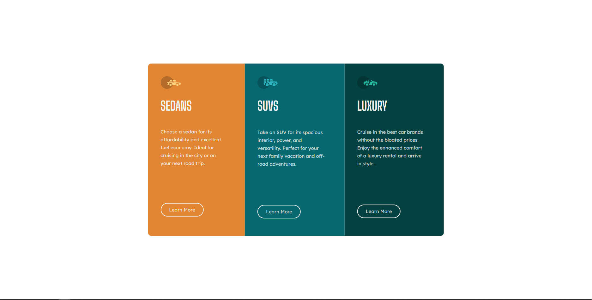

# Frontend Mentor - 3-column preview card component solution

This is a solution to the [3-column preview card component challenge on Frontend Mentor](https://www.frontendmentor.io/challenges/3column-preview-card-component-pH92eAR2-). Frontend Mentor challenges help you improve your coding skills by building realistic projects. 

## Table of contents

- [Overview](#overview)
  - [The challenge](#the-challenge)
  - [Screenshot](#screenshot)
- [My process](#my-process)
  - [Built with](#built-with)
  - [What I learned](#what-i-learned)
  - [Continued development](#continued-development)
  - [Useful resources](#useful-resources)
- [Author](#author)

## Overview

### The challenge

Users should be able to:

- View the optimal layout depending on their device's screen size
- See hover states for interactive elements

### Screenshot



## My process

I first had a look at the design layout of the webpage and imagined what I saw in how it could be structured in HTML, keeping in mind that for this particular layout, using flexbox would be the better choice.
After structuring the HTML, I then moved to adding the various CSS properties to each element based on how it needed to look in the design (mobile and desktop).

### Built with

- Semantic HTML5 markup
- CSS3 custom properties
- Flexbox
- Responsive Design workflow

### What I learned

Major learnings:

- HTML5 Markup : When wanting to use Flex-Box CSS property you need to use a container with child containers as the flexbox items.
```html
<div class="flex-container">
  <div class="flexitem1"></div>
  <div class="flexitem2"></div>
  <div class="flexitem3"></div>
</div>
```

- CSS Styling : These properties I found useful while completing this project to produce the desired style.
```css
  display: flex;
  flex: 1 1 0; /*Used as short-hand for Flex-grow, Flex-shrink, Flex-basis*/

  /*Absolute and Relative positioning: 
    absolute : used to take element out of document flow.
    relative : used to position relative to the parent element.
  */
  /*Set box to the center of the screen*/
    position: absolute;
    left: 50%;
    top: 50%;
    transform: translate(-50%,-50%);

  /*Use max and min with percentages to achieve responsiveness in width and height*/
    max-height: 0%;
    min-height: 0%;
    max-width: 0%;
    min-width: 0%;
```

### Continued development

- Flexbox properties
- Responsive design : layout and positioning

### Useful resources

- [YoutTube Resource](https://www.youtube.com/watch?v=sanswTlz4ZY) - This helped me with implementing my layout using flexbox. I already had some understanding with flexbox however this helped me with the design layout specified. Would recommend to beginners for added understanding of the flexbox property.

## Author

- Email - [Devon Gribbin](devongribbin@gmail.com)
