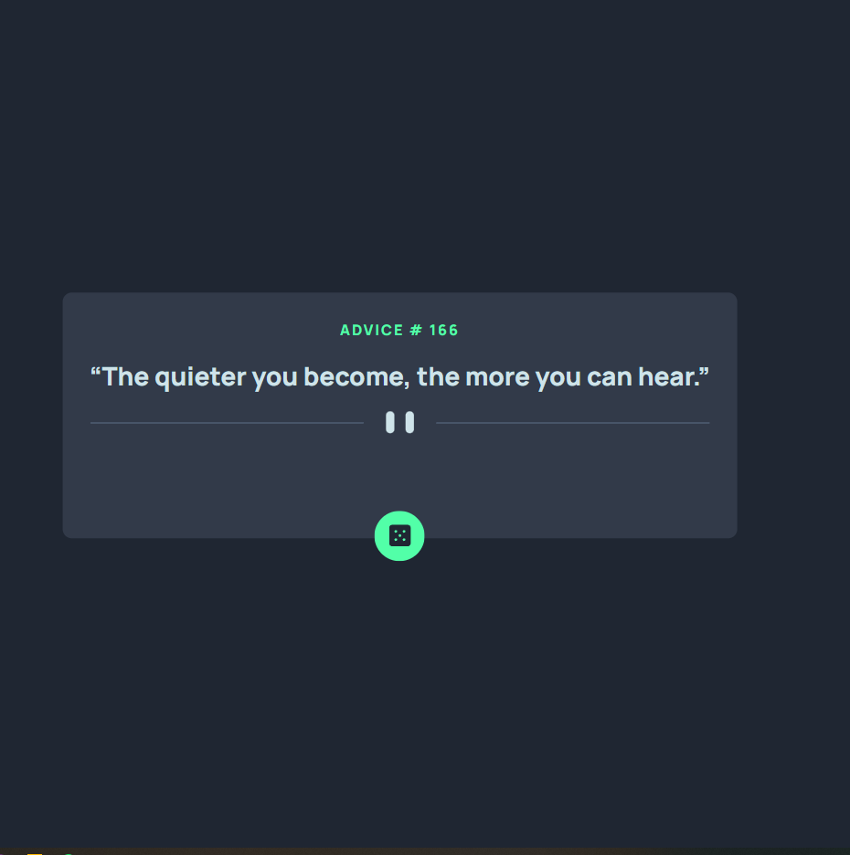
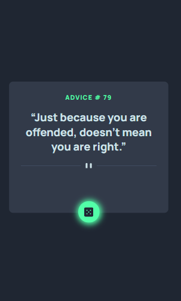

# Frontend Mentor - Advice generator app solution

This is a solution to the [Advice generator app challenge on Frontend Mentor](https://www.frontendmentor.io/challenges/advice-generator-app-QdUG-13db). Frontend Mentor challenges help you improve your coding skills by building realistic projects.

## Table of contents

- [Overview](#overview)
  - [The challenge](#the-challenge)
  - [Screenshot](#screenshot)
- [My process](#my-process)
  - [Built with](#built-with)
  - [What I learned](#what-i-learned)
  - [Continued development](#continued-development)
  - [Useful resources](#useful-resources)
- [Author](#author)

## Overview

### The challenge

Users should be able to:

- View the optimal layout for the app depending on their device's screen size
- See hover states for all interactive elements on the page
- Generate a new piece of advice by clicking the dice icon

### Screenshot





## My process

### Built with

- Semantic HTML5 markup
- CSS custom properties
- Mobile-first workflow
- Vanilla JavaScript

### What I learned

Major learnings:

- Using JavaScript to create a GET request to an endpoint to request information from a server.
```js
document.getElementById('generator-button').addEventListener('click', () => {
    const adviceId = document.getElementById('adviceID');
    const adviceText = document.getElementById('advice-text');
    //create and send new advice xhr from adviceslip.com
    const xhr = new XMLHttpRequest();
    xhr.open('GET', "https://api.adviceslip.com/advice");
    xhr.send();
    xhr.responseType = 'json'; // ensure JSON response received

    xhr.onload = () => {
        //if the state of the client is 4 (DONE) and if the status code is 200 (successful)
        //update the text of the html elements with data received from the server
        if (xhr.readyState == 4 || xhr.status == 200) {
            const data = xhr.response;
            adviceId.innerHTML = data['slip']['id'];
            adviceText.innerHTML = data['slip']['advice'];
        } else {
            console.log(xhr.status);
        }
    }
});
```

### Continued development

- Using JavaScript to create HTTP requests
- Learning more CSS properties to implement more complex designs and behaviour.

### Useful resources

- [HTTP Requests in JS](https://kinsta.com/knowledgebase/javascript-http-request/#:~:text=To%20send%20a%20successful%20GET%20request%20using%20XMLHttpRequest,the%20request.%204%20Listen%20for%20the%20server%E2%80%99s%20response) - This helped me understand HTTP requests. I really liked this pattern and will use it going forward. There are probably many different ways to implement this solution and I plan to learn more about it.

## Author

- Author - [Devon Gribbin](devongribbin@gmail.com)

