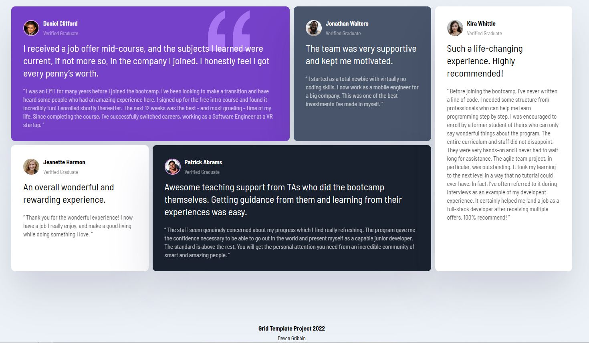

# Frontend Mentor - Testimonials grid section solution

This is a solution to the [Testimonials grid section challenge on Frontend Mentor](https://www.frontendmentor.io/challenges/testimonials-grid-section-Nnw6J7Un7). Frontend Mentor challenges help you improve your coding skills by building realistic projects. 

## Table of contents

- [Overview](#overview)
  - [The challenge](#the-challenge)
  - [Screenshot](#screenshot)
- [My process](#my-process)
  - [Built with](#built-with)
  - [What I learned](#what-i-learned)
  - [Continued development](#continued-development)
  - [Useful resources](#useful-resources)

**Note: Delete this note and update the table of contents based on what sections you keep.**

## Overview

### The challenge

Users should be able to:

- View the optimal layout for the site depending on their device's screen size

### Screenshot



## My process

### Built with

- Semantic HTML5 markup
- CSS custom properties
- Flexbox
- CSS Grid
- Mobile-first workflow

### What I learned

I learnt how to use the Grid Layout and refined my understanding of Flexbox. A tribute must be made to Traversy Media, thanks Brad!

```html
<div class="grid">
    <div class="card card-moderate-violet">
      <header class="card-header">
        
        <div>
          <h3>Daniel Clifford</h3>
          <p>Verified Graduate</p>
        </div>
      </header>
      <p class="card-lead">
        I received a job offer mid-course, and the subjects I learned were current, if not more so, 
        in the company I joined. I honestly feel I got every penny’s worth.
      </p>
      <p class="card-quote">
        “ I was an EMT for many years before I joined the bootcamp. I’ve been looking to make a 
        transition and have heard some people who had an amazing experience here. I signed up 
        for the free intro course and found it incredibly fun! I enrolled shortly thereafter. 
        The next 12 weeks was the best - and most grueling - time of my life. Since completing 
        the course, I’ve successfully switched careers, working as a Software Engineer at a VR startup. ”
      </p>
    </div>
```
```css
.grid {
    max-width: 1440px;
    margin: 100px auto;
    padding: 20px;
    display: grid;
    grid-template-columns: repeat(4, 1fr);
    grid-template-areas:
        'daniel daniel jonathan kira'
        'jeanette patrick patrick kira'
    ;
    column-gap: 10px;
}

.card:nth-of-type(1) {
    grid-area: daniel;
}

.card:nth-of-type(2) {
    grid-area: jonathan;
}

.card:nth-of-type(3) {
    grid-area: jeanette;
}

.card:nth-of-type(4) {
    grid-area: patrick;
}

.card:nth-of-type(5) {
    grid-area: kira;
}
```

### Continued development

Perfect using the Grid Layout.

### Useful resources

- [CSS GRID Crash Course](https://www.youtube.com/watch?v=0xMQfnTU6oo) - This helped me creating the grid layout.

